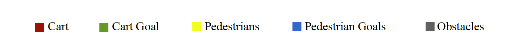
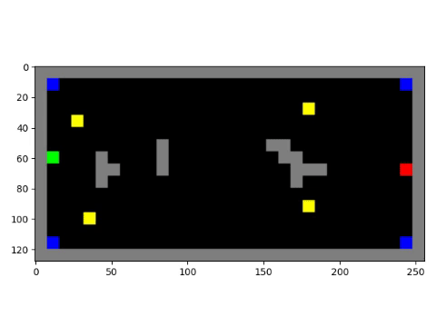
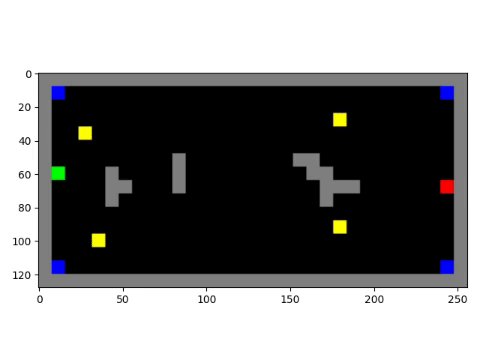

# Intention Aware Online POMDP Planning for Autonomous Driving in Dynamic Environment with Simulated Crowd

This is our attempt at replicating the results of the famous ICRA 2015 paper on Intention aware Online 
POMDP planning for autonomous systems.  

This project is a part of our course **ASEN 6519 - Decision Making Under Uncertainty** that we 
took with **Professor Zachary Sunberg** in Spring 2020 at CU Boulder.

## Problem Statement:

There are many successful autonomous vehicles today, but it is still uncommon to see autonomous 
vehicles driving among many pedestrians. To drive near pedestrians safely, efficiently, 
and smoothly, autonomous vehicles must estimate unknown pedestrian intentions and hedge 
against the uncertainty in intention estimates in order to choose actions that are effective 
and robust. They must also reason about the long-term effects of immediate actions.

Simple reactive control methods are inadequate here. They choose actions based on sensor
 data on the current system state. They do not hedge against sensing uncertainty and do not 
 consider an action’s long-term effects. This often results in overly aggressive or 
 conservative actions, or attractive short-term actions with undesirable longer-term 
 consequences.

## Approach:

POMDP planning provides a systematic approach to overcome these issues. The Partially 
Observable Markov Decision Process (POMDP) is a mathematical tool that can efficiently 
hedge against uncertainties to provide reliable, robust and optimal decisions or plans 
or control. In this project, we are reproducing the work of this 
[paper](https://www.comp.nus.edu.sg/~leews/publications/bai2015intention.pdf) for successful 
navigation of an autonomous cart in a dynamic environment using online POMDP planners. 

We constructed a POMDP model for autonomous driving in a dynamic environment with pedestrians. 
The POMDP model captures the uncertainty in pedestrian intentions and maintains a belief over 
pedestrian goals. In this project, we applied DESPOT, a state-of-the-art approximate online 
POMDP planning algorithm, to autonomous driving in a complex, dynamic environment.

We run everything in simulations on a discrete grid world with hand designed complex human 
motion trajectories.

## Simulations:

while(cart ! @Goal state)
 
1) The cart generates a path from 
its current position to its goal position using A* algorithm.
2) The generated path is sent to the POMDP planner which returns the best 
possible action to take at that step. Possible choices of options are 
`DECELERATE`, `MAINTAIN` and `ACCELERATE`.
3) If the cart's current velocity is v, then the cart moves v steps 
forward on the path generated by A*
4) Human moves just one step according to some predefined trajectory.
5) Cart observes human's new position and updates its belief 
distribution over human's goals.

#### Experiment #1:

#### Experiment #2:

#### Experiment #3:

